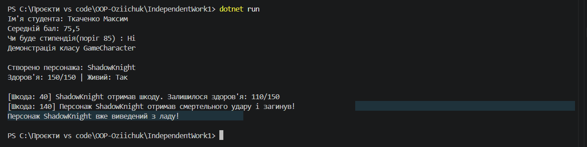

# Самостійна робота №1: Базовий синтаксис C# і оголошення класів

**Студент:** Озійчук  
**Проєкт:** IndependentWork1  
**Тема:** Базовий синтаксис C# і оголошення класів  

## Мета роботи
Закріпити навички оголошення класів, приватних полів, публічних властивостей, валідації даних та методів із внутрішньою логікою у C#.

## Реалізовані класи

У проєкті реалізовано 2 оригінальні класи з власною поведінкою та обчисленнями:

1. **`GameCharacter`** — ігровий персонаж із відстеженням рівня здоров'я, валідацією шкоди та перевіркою стану життя.
2. **`Student`** — модель студента з перевіркою середнього балу та розрахунком претендування на стипендію.

## Результат виконання програми

