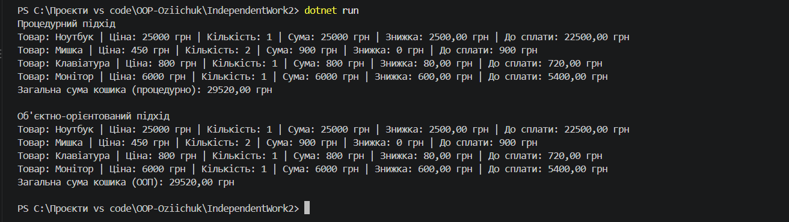

# Самостійна робота №2

**Студент:** Озійчук   
**Тема:** Процедурний і об’єктний підходи: порівняння на прикладі

---

## Мета роботи
Побачити на практиці різницю між процедурним і об’єктним підходами до організації коду,переписавши процедурний приклад інтернет-магазину у вигляді класів

## Проблеми процедурної версії
1. **Розкиданість даних (Відсутність цілісності):** Дані про один товар розбиті по паралельних масивах. При зміні одного масиву легко порушити зв'язок між елементами.
2. **Ризик неузгодженості розмінностей:** Немає гарантії, що всі масиви мають однакову довжину. Якщо один із масивів буде коротшим, програма впаде з помилкою.
3. **Складність повторного використання:** Логіка розрахунку знижки прив'язана до конкретних масивів. Для передачі кошика в інший модуль доведеться передавати всі масиви окремо замість одного об'єкта.

## Порівняльний аналіз підходів
 Перехід від процедурного підходу до об’єктно-орієнтованого кардинально змінює організацію коду: замість використання трьох паралельних масивів примітивних типів, дані тепер об’єднані в цілісні класи `Product` та `Cart`, що забезпечує природний зв'язок між характеристиками товару та його кількістю. Завдяки цій структурі значно спростилося розширення програми, оскільки нові операції (наприклад, видалення товару з кошика) реалізуються як окремі методи класу `Cart`, не вимагаючи ручного узгодження елементів за індексами у кількох масивах одночасно. Окрім цього, об’єктна версія гарантує високий рівень повторного використання коду та інкапсуляцію, адже увесь екземпляр кошика разом із логікою розрахунку підсумку та знижок можна легко передавати між різними модулями програми як єдину сутність, не ризикуючи випадково пошкодити внутрішні дані чи реалізувати некоректну бізнес-логіку

---

## Результат виконання програми

