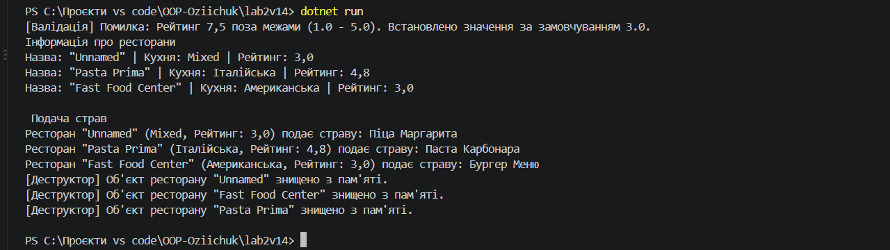

# Лабораторна робота №2: Клас із кількома конструкторами. Життєвий цикл об’єкта.

**Студент:** Озійчук  
**Варіант:** 14  
**Тема:** Класи, приватні поля, валідація властивостей, перевантаження конструкторів та деструктори

---

## Мета роботи
Ознайомитися з основними поняттями об'єктно-орієнтованого програмування в C#: реалізацією валідації даних у сеттерах, використанням перевантажених конструкторів з викликом `: this()`, а також вивчити принцип роботи збирача сміття (Garbage Collector) та деструкторів об'єктів.

---

## Результат виконання програми

