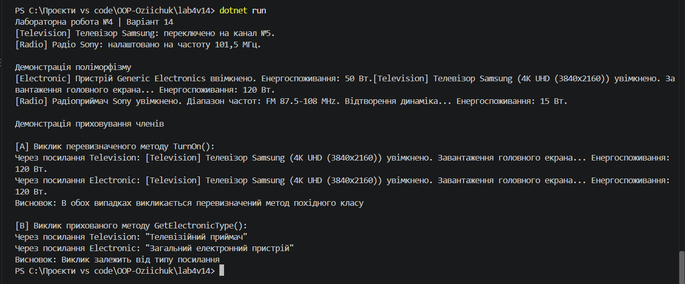

# Лабораторна робота №4

**Студент:** Озійчук  
**Варіант:** 14  
**Тема:** Наслідування. Ключові слова base, override, virtual. Приховування членів (new).

---

## Мета роботи
Навчитися створювати ієрархії класів, використовувати ключові слова `base`, `virtual`, `override` для реалізації поліморфізму, а також зрозуміти відмінності між перевизначенням методів (`override`) та приховуванням членів базового класу за допомогою модифікатора `new`.

---

## Результат виконання програми

