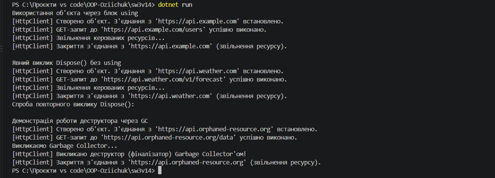

# Самостійна робота №3

**Студент:** Озійчук  
**Варіант:** 14  
**Тема:** Життєвий цикл об’єкта та керування ресурсами.

---

## Мета роботи
Поглибити розуміння життєвого циклу об’єкта в C#, навчитися працювати з некерованими
ресурсами, самостійно реалізувати інтерфейс IDisposable та патерн Dispose.

## Висновок щодо сценаріїв використання

* **Сценарій 1 (`using`):** Найбільш надійний та рекомендований спосіб роботи з об'єктами, що реалізують `IDisposable`. Конструкція `using` гарантує автоматичний виклик `Dispose()` при виході з блоку, навіть якщо під час виконання виникне виняток.
* **Сценарій 2 (Явний виклик `Dispose()`):** Дозволяє контролювати момент звільнення ресурсів вручну, проте є ризикованим: якщо між створенням об'єкта та викликом `Dispose()` станеться помилка, ресурси залишаться висіти в пам'яті. Прапорець `_disposed` гарантує безпеку при повторному виклику методу.
* **Сценарій 3 (Автоматична фіналізація через GC):** Використовується як «резервний механізм». Якщо розробник забув викликати `Dispose()`, збирач сміття (`Garbage Collector`) рано чи пізно викличе деструктор `~HttpClient()`, який виконає `Dispose(false)` і закриє з'єднання. Однак цей спосіб не детермінований у часі, вимагає більше ресурсів системи та викликається лише після `GC.Collect()` і `GC.WaitForPendingFinalizers()`.

---

## Результат виконання програми

## Відповіді на контрольні запитання

1. **Що таке життєвий цикл об’єкта в .NET?**
   Це послідовність етапів, які проходить об'єкт: створення (виділення пам'яті в купі та виклик конструктора) -> використання (доступ через посилання) -> збирання сміття (визначення втрати посилань на об'єкт) -> фіналізація (виклик деструктора) -> звільнення пам'яті.

2. **Яка різниця між керованими та некерованими ресурсами?**
   Керовані ресурси — це об'єкти, виділені в керованій купі .NET (наприклад, `string`, `List`), які Garbage Collector звільняє повністю автоматично. Некеровані ресурси — це ресурси операційної системи (файлові дескриптори, мережеві сокети, з'єднання з БД), які GC не вміє звільняти самостійно.

3. **Для чого призначений інтерфейс IDisposable?**
   Він дає змогу реалізувати детерміноване (кероване розробником) негайне звільнення некерованих ресурсів, не чекаючи, поки спрацює Garbage Collector.

4. **Як оператор using допомагає в керуванні ресурсами?**
   Оператор `using` загортає роботу з об'єктом у блок `try-finally` і автоматично викликає метод `.Dispose()` у секції `finally`, що гарантує звільнення ресурсів за будь-яких умов.

5. **Навіщо в патерні Dispose використовується метод GC.SuppressFinalize()?**
   Цей метод повідомляє Garbage Collector, що об'єкт вже самостійно звільнив свої ресурси і його не потрібно додавати в чергу фіналізації, що суттєво оптимізує продуктивність програми.

6. **Чому в деструкторі викликається Dispose(false), а в методі Dispose() — Dispose(true)?**
   При `Dispose(true)` звільняються як керовані, так і некеровані ресурси, оскільки виклик відбувається свідомо під час життя програми. При `Dispose(false)` (з деструктора) звільняються **тільки некеровані ресурси**, адже інші керовані об'єкти на момент роботи GC вже можуть бути знищені, і звернення до них спричинить помилку.

